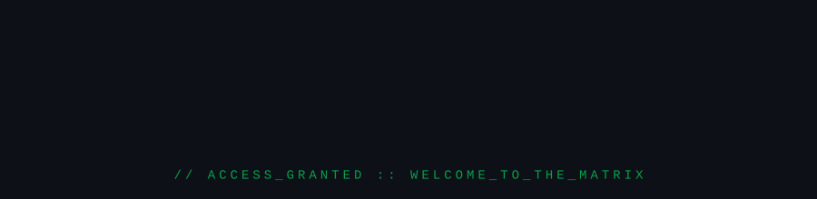

<div align="center">



</div>

---

## ⚡ // SYSTEM_OVERVIEW

> **`> ATTEMPTING_CONNECTION...`**  
> **`> ACCESS_GRANTED: WELCOME_TO_THE_MATRIX`**

<div align="center">


</div>

Bienvenue dans le journal de bord de mon cursus à **École 42 Paris**. Voici l'ensemble des modules, algorithmes, moteurs graphiques et architectures réseaux développés au cours de ma progression.

---

## 📐 // TECH_STACK_MATRIX

<div align="center">
  
```
+-----------------------------------------------------------------------+
|  LANGAGES   |  C  |  C++  |  TYPESCRIPT  |  SQL                       |
+-------------+---------------------------------------------------------+
|  SYSTEME    |  LINUX  |  UNIX  |  DOCKER  |  MAKE                     |
+-------------+---------------------------------------------------------+
|  WEB/NETWORK|  NESTJS  |  VUE 3  |  WEBSOCKETS  |  NGINX  |  REST     |
+-----------------------------------------------------------------------+
```
</div>

<br/>

---

## 🚀 // 42_PROJECT_LOGS

### 🔹 [01] FOUNDATIONS & BASICS
> *Prise en main de la mémoire, réécriture de la libc et gestion des entrées/sorties.*

| Projet | Description / Focus | Techs |
| :--- | :--- | :---: |
| **`Libft`** | Reconstitution intégrale d'une bibliothèque C personnalisée (*memory, strings, linked lists*). | `C` `Makefile` |
| **`ft_printf`** | Implémentation custom de `printf` avec gestion variadique des arguments. | `C` |
| **`Get_next_line`** | Algorithme de lecture ligne par ligne depuis un descripteur de fichier via un buffer statique. | `C` `Pointers` |

---

### 🔹 [02] ALGORITHMS & PIPELINES
> *Optimisation sous contraintes d'exécution et manipulation de descripteurs Unix.*

| Projet | Description / Focus | Techs |
| :--- | :--- | :---: |
| **`Push_swap`** | Algorithme de tri optimisé sur deux piles avec un ensemble d'instructions restreint. | `C` `Algo` |
| **`Pipex`** | Reproduction du comportement des pipes shell (`\|`) et redirections en C. | `C` `Unix` `Fork` |

---

### 🔹 [03] GRAPHICS & CONCURRENCY
> *Rendu 2D/3D temps réel et gestion des threads/processus concurrents.*

| Projet | Description / Focus | Techs |
| :--- | :--- | :---: |
| **`So_long`** | Jeu 2D top-down utilisant la MiniLibX (*textures, mouvements, gestion des événements*). | `C` `MiniLibX` |
| **`Cub3d`** | Moteur graphique 3D type *Wolfenstein 3D* basé sur la technique du Raycasting. | `C` `Raycasting` `Math` |
| **`Philosophers`** | Résolution du problème des philosophes mangeurs (*threads, mutexes, starvation, dataraces*). | `C` `POSIX Threads` |

---

### 🔹 [04] SHELL & ADVANCED C++
> *Création d'un interpréteur de commandes complet et programmation orientée objet avancée.*

| Projet | Description / Focus | Techs |
| :--- | :--- | :---: |
| **`Minishell`** | Recréation d'un mini Shell Bash (*parsing, AST, builtins, env, signals, execution*). | `C` `Unix Shell` |
| **`CPP Modules`** | Série de 10 modules (00 à 09) couvrant la POO, l'orthodox canonical form, templates, STL. | `C++98` `OOP` |

---

### 🔹 [05] INFRASTRUCTURE & ARCHITECTURE
> *Serveurs web bas niveau, conteneurisation et applications web distribuées.*

| Projet | Description / Focus | Techs |
| :--- | :--- | :---: |
| **`Webserv`** | Serveur HTTP/1.1 non-bloquant développé de zéro (*epoll/kqueue, I/O multiplexing, CGI*). | `C++` `Sockets` |
| **`ft_Transcendence`** | Plateforme web multijoueur complète avec jeu Pong temps réel, chat, authentification & SPA. | `NestJS` `Vue3` `Docker` |

---

## 📊 // SYSTEM_STATS

<div align="center">


</div>

<div align="center">

<!-- CARTE STATS (Fond Sombre #0D0D0D + Texte Vert Néon #00FF66) -->


</div>

---

<div align="center">

/// END OF TRANSMISSION ///

</div>
