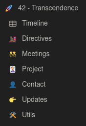
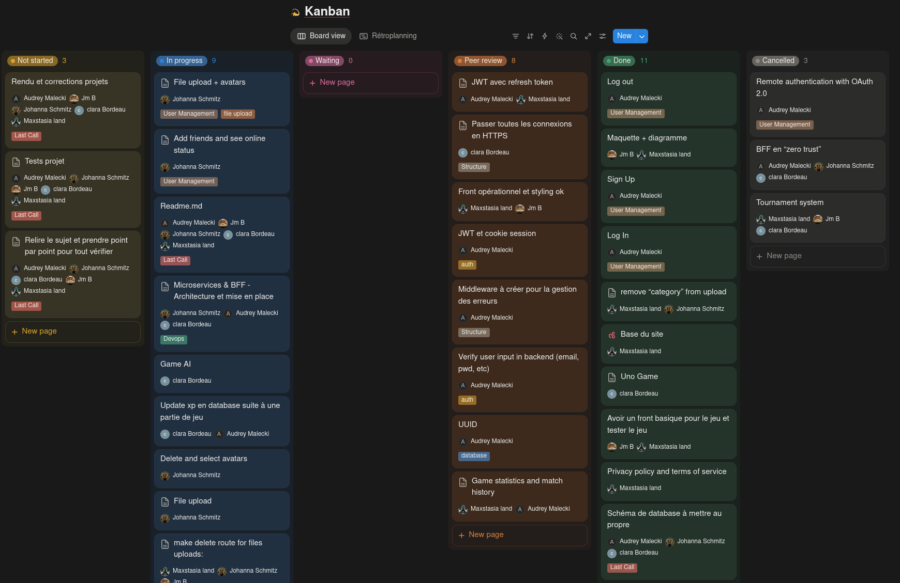
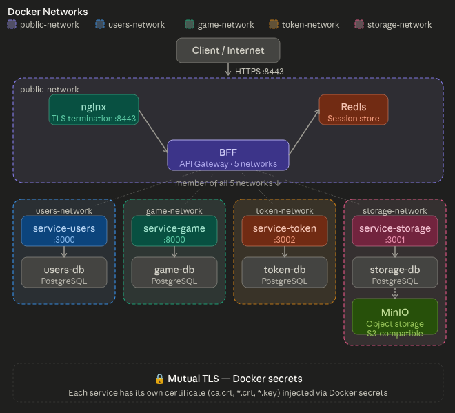
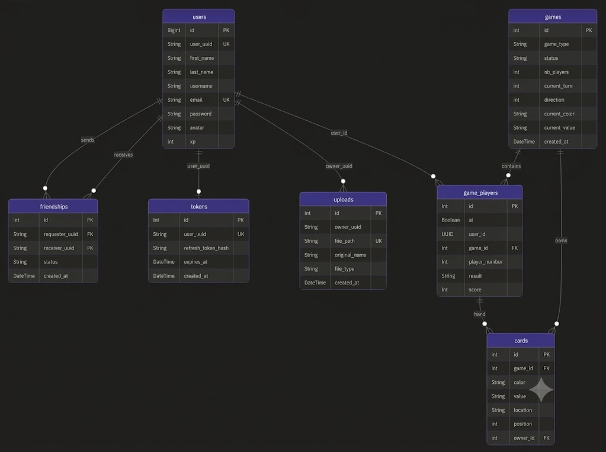

*This project has been created as part of the 42 curriculum by jschmitz, cbordeau, audmalec, jbias, mstasiak.*

# ft_uno

This project was developed as part of the 42 curriculum and follows the Transcendence subject specification version 21.1.

## Table of Contents

- [Project Description](#project-description)
- [Instructions](#instructions)
- [Team](#team)
- [Technical Stack](#technical-stack)
- [Databases Schema](#databases-schema)
- [Detailed Features Breakdown](#detailed-features-breakdown)
- [Modules Validation Checklist](#modules-validation-checklist)
- [Individual Contributions](#individual-contributions)
- [Resources](#resources)

## Project Description

**ft_uno** is a full-stack web application that allows users to play UNO online in real time through a secure and scalable microservices architecture.

Developed as part of the 42 curriculum, the project aims to demonstrate modern web development practices, including microservices, real-time communication, secure authentication, containerization, and service orchestration.

The application consists of a frontend, a Backend-for-Frontend (BFF), multiple backend microservices, and a database layer. Users can create an account, authenticate using their email and password, and join online multiplayer UNO games through a responsive web interface.

To improve security, authentication tokens are never exposed to the frontend. The BFF is responsible for managing access and refresh tokens, while Redis is used as a cache layer to store session data and generate secure session cookies. This approach centralizes authentication management and reduces the risk of token leakage.

### Key Features

- Real-time multiplayer UNO gameplay
- User registration and authentication
- Secure session management using Redis
- Backend-for-Frontend (BFF) architecture
- Microservices-based backend
- REST APIs and WebSocket communication
- Persistent data storage
- Containerized deployment with Docker Compose
- Reverse proxy and TLS termination with Nginx
- Scalable and maintainable service-oriented architecture

### Project Goal

The goal of **ft_uno** is to provide a reliable and secure multiplayer gaming platform while showcasing a production-oriented architecture that emphasizes scalability, maintainability, and modern software engineering practices.

## Instructions

### Prerequisites

Before running the project, ensure the following tools are installed on your system:

- Podman 5.8.2 or Docker Engine 27.x-28.x
- GNU Make 4.4.1

### Clone the repository
```bash
git clone <repository_url>
cd Transcendence
```

### Environment Configuration

A centralized `.env.example` file is provided in the `srcs` directory and contains all required environment variables for the application. Through the Docker Compose configuration, each service only receives the variables it needs, limiting unnecessary exposure of sensitive data across containers.

Before starting the application, create a `.env` file from the provided template:

```bash
cp srcs/.env.example srcs/.env
```

Example configuration:

```ini
# Mutable values
USERS_DB=
USERS_DB_USER=
USERS_DB_PASSWORD=

STORAGE_DB=
STORAGE_DB_USER=
STORAGE_DB_PASSWORD=

TOKEN_DB=
TOKEN_DB_USER=
TOKEN_DB_PASSWORD=

GAME_DB=
GAME_DB_USER=
GAME_DB_PASSWORD=

MINIO_ROOT_USER=
MINIO_ROOT_PASSWORD=
MINIO_BUCKET=

JWT_ACCESS_SECRET=
JWT_REFRESH_SECRET=
TOKEN_ACC_EXP=

REDIS_SECRET=

# Test users
T1_UUID=
T2_UUID=
T3_UUID=
T4_UUID=

# Immutable values
ENCRYPTION_ALGO=
PORT_DB=
PORT_MINIO_INT=
PORT_MINIO_GUI=
MINIO_PUBLIC_URL=
PORT_STORAGE=
PORT_USERS=
PORT_BFF=
PORT_MS_TOKEN=
PORT_GAME=
REDIS_URL=
```

> **Important:** Never commit populated `.env` files or production secrets to the repository.

### Running the Application

From the repository root:

#### Start all services

```bash
make
```

#### Stop and remove containers

```bash
make clean
```

#### Rebuild the entire stack

```bash
make re
```

### Services Overview

The application is composed of the following containers:

| Container | Description |
|------------|-------------|
| BFF | Backend-for-Frontend responsible for API aggregation, WebSocket handling, authentication flow, and session management |
| Users Service | User account management, profiles, and friends features |
| Token Service | JWT generation, validation, and refresh token management |
| Game Service | Real-time UNO game logic and gameplay management |
| Storage Service | Asset and file management |
| Users Database | Dedicated PostgreSQL database owned by the Users Service |
| Token Database | Dedicated PostgreSQL database owned by the Token Service |
| Game Database | Dedicated PostgreSQL database owned by the Game Service |
| Storage Database | Dedicated PostgreSQL database owned by the Storage Service |
| Redis | Cache layer used for session management and temporary token storage |
| MinIO | S3-compatible object storage for user-uploaded assets |
| Nginx | Reverse proxy, HTTPS termination, and entry point to the platform |

### Accessing the Application

Once all services are running, the application is available through the URL:
```bash
https://[ip]:8443
```

The frontend communicates exclusively with the BFF. Authentication tokens remain internal to the backend infrastructure and are never exposed to the client. User sessions are managed through secure cookies backed by Redis.

## Team

### Team Members

- **Jean Michel** — **Product Owner & Frontend Developer**  
  Responsible for UI development, frontend integration, and game interface implementation.

- **Clara** — **Technical Lead & Backend Developer**  
  Designed and implemented the game logic, AI components, and backend architecture related to the game server and real-time socket communication.

- **Audrey** — **Project Manager & Backend Developer**  
  Coordinated project development and contributed to the backend architecture, BFF orchestration, authentication system, and user service.

- **Maxence** — **Frontend Developer**  
  Focused on user experience, interface improvements, visual consistency, and frontend testing.

- **Johanna** — **Backend Developer**  
  Contributed to the user service, friend management features, storage service, and Docker network configuration.

### Project Management

#### Work Organization

The team followed an agile-inspired workflow based on continuous communication and iterative development.

We held **daily stand-up meetings** to share progress, align on current tasks, and discuss any blockers. These sessions were also used to compare experiences across the team, which helped identify recurring issues early and avoid duplicated debugging efforts.

Task distribution was defined early based on individual preferences and strengths. The team naturally split into two main groups:
- One team focused on the **game development**, including real-time gameplay and core UNO logic.
- The other team handled the **user-related ecosystem**, including authentication, user management, friends system, and supporting services.

This separation allowed each group to progress independently while maintaining regular synchronization points.

#### Tools Used

- **Notion** — used as the central workspace for the project:
  - Kanban board for task tracking and progress monitoring
  - Meeting minutes and documentation
  - Centralized resources (links, references, technical notes)

 
 

- **GitHub** — used for version control and collaboration:
  - Issue tracking via GitHub Issues
  - Pull Requests with peer reviews before merging
  - Code review and validation process through PR discussions

#### Communication Channels

- **Discord** was the main communication tool used by the team.
  It served as the primary channel for daily coordination, quick discussions, and relaying important updates between members.

## Technical Stack

#### Frontend
- Vue 3 (TypeScript)
- Vite
- Vue Router
- Pinia (state management)
- Bootstrap

#### Backend
- Node.js (Express)
- Socket.IO (real-time communication)
- JSON Web Token (authentication)
- bcrypt (password hashing)
- UUID v7 (unique identifiers)
- Python (FastAPI) for game service

#### Database
- PostgreSQL (multiple isolated databases per service)
- Prisma (Node.js ORM)
- SQLAlchemy (Python ORM)

#### Other Technologies
- Nginx (reverse proxy and TLS termination)
- Redis (session state + refresh token tracking)
- MinIO (S3-compatible object storage)

### Justification

#### Frontend choice
Vue 3 combined with Vite was chosen for its simplicity, performance, and fast development feedback loop. Vue’s component-based architecture allows for a clean separation of concerns, while Vite significantly improves build speed and hot module replacement, making frontend iteration efficient. Pinia was selected as a lightweight and modern state management solution aligned with Vue 3.

#### Backend architecture
Node.js with Express was used for the BFF and most microservices due to its lightweight nature and strong ecosystem for handling HTTP APIs and WebSockets. Socket.IO was chosen to simplify real-time communication required for multiplayer gameplay and live updates.

Python with FastAPI was introduced specifically for the game service, as it provides strong support for performance-oriented logic, clean API design, and flexibility for implementing game mechanics.

#### Database system
PostgreSQL was selected for its reliability, relational structure, and strong support for concurrent workloads. Each microservice owns its own database to enforce service isolation and scalability. This avoids tight coupling between services and improves maintainability. Prisma and SQLAlchemy were used as ORMs to simplify database interactions while maintaining type safety and productivity.

#### Additional technologies
- Redis was used to handle session caching and temporary token storage, improving performance and reducing database load.
- MinIO was chosen as an S3-compatible solution for storing user-generated assets in a scalable and self-hosted way.
- Nginx acts as a reverse proxy and TLS termination layer, providing a single entry point to the system while improving security and routing control.

Overall, the stack was designed to balance developer productivity, scalability, and clear separation of concerns in a microservices architecture.

## Databases Schema

The application follows a **database-per-service** architecture. Each microservice owns its dedicated PostgreSQL database, ensuring service isolation and reducing coupling between domains.

### Project Schema


#### Inbound traffic

The client connects over HTTPS on port `8443`. nginx handles TLS termination and proxies requests to the BFF.

#### BFF (Backend For Frontend)

The BFF is the central gateway of the application. It belongs simultaneously to all five isolated Docker networks (`public-network`, `users-network`, `storage-network`, `token-network`, `game-network`) and dispatches requests to the appropriate microservices. It uses Redis for session management.

#### Microservices

Each service runs in its own isolated network with a dedicated PostgreSQL database:

| Service | Database | Notes |
|---|---|---|
| `service-users` | `users-db` | |
| `service-game` | `game-db` | |
| `service-token` | `token-db` | |
| `service-storage` | `storage-db` | Also connects to MinIO for S3-compatible object storage (avatars, files) |

#### TLS security

Each service has its own certificate injected at runtime via Docker secrets, all signed by a shared internal CA. `NODE_EXTRA_CA_CERTS` is passed as an environment variable so Node.js trusts the internal CA.

### Databases

#### Overview


#### Database Architecture

The system follows a microservices architecture, where each service owns and manages its own isolated database. This approach ensures clear service boundaries, independent deployments, and improved scalability.

Although the databases are physically separated, they are logically connected through a shared `user_uuid` identifier:

| Service | Table | Relationship |
|----------|---------|--------------|
| Auth Service | `tokens.user_uuid` | 1:1 — one active refresh token per user |
| Upload Service | `uploads.owner_uuid` | 1:N — a user can own multiple uploaded files |
| Game Service | `game_players.user_id` | 1:N — a user can participate in multiple game sessions |

##### Cross-Service Relationships

These relationships are **logical associations rather than database-level foreign keys**. Since each microservice maintains its own datastore, referential integrity is not enforced by the database engine itself.

Instead, consistency is handled at the **application and service layer**, which is a common pattern in distributed microservice systems. This design provides:

- Loose coupling between services
- Independent database evolution
- Better scalability and fault isolation
- Autonomous service ownership
- Simplified deployments and migrations

As a result, services can operate independently while still sharing a common user identity across the platform through `user_uuid`.

## Detailed Features Breakdown

### Frontend (SPA)
- **Implemented by:** Maxence, Jean Michel  
- **Description:**  
  Single-page application built with Vue 3 providing the entire user interface, including authentication pages, game interface, routing, asset handling, and global state management using Pinia. The frontend communicates exclusively with the BFF.

### Backend-for-Frontend (BFF) & WebSocket Layer
- **Implemented by:** Clara, Audrey, Johanna  
- **Description:**  
  Central API gateway responsible for request aggregation, authentication flow, and WebSocket orchestration. It acts as the single entry point between the frontend and backend microservices, managing real-time communication for gameplay.

### User Management System
- **Implemented by:** Johanna, Audrey  
- **Description:**  
  Handles user registration and authentication using email/password, profile management, avatar upload, friend system, and user-related data retrieval.

### Authentication System (JWT + Refresh Tokens)
- **Implemented by:** Johanna, Audrey  
- **Description:**  
  Secure authentication mechanism using short-lived JWT access tokens and refresh tokens with rotation. Tokens are managed server-side and protected through the BFF layer.

### Real-time Gameplay (WebSockets)
- **Implemented by:** Clara  
- **Description:**  
  Provides real-time synchronization of game state between players, handling in-game events, turn management, and match flow through WebSocket communication.

### Game Service (`service-game`)
- **Implemented by:** Clara  
- **Description:**  
  Python-based service responsible for core UNO game logic, including match lifecycle, rules enforcement, scoring system, and server-side simulation.

### Storage Service (MinIO)
- **Implemented by:** Johanna  
- **Description:**  
  Manages file storage for user uploads and assets using MinIO. Provides secure upload/download endpoints and integration with frontend resources.

### User Statistics System
- **Implemented by:** Audrey, Clara  
- **Description:**  
  Aggregates match results and computes player statistics such as scores, win/loss history, and leaderboard data.

### Nginx Reverse Proxy & TLS
- **Implemented by:** Audrey, Johanna, Clara  
- **Description:**  
  Handles HTTPS termination and request routing. Serves the frontend and redirects API calls to the BFF while ensuring secure external access.

## Modules Validation Checklist

| Module | Type | Points | Implemented | Description | Contributors |
|--------|------|--------|--------------|-------------|---------------|
| Web: Frontend + Backend frameworks | Major | 2 | ✅ | Full-stack architecture with Vue 3 frontend and Node.js microservices + BFF | Jean Michel, Maxence, Clara, Audrey, Johanna |
| Web: Frontend frameworks | Minor | 1 | ✅ | Vue 3 + Vite + Pinia + TypeScript frontend SPA | Jean Michel, Maxence |
| Web: Backend frameworks | Minor | 1 | ✅ | Express-based microservices with Prisma ORM | Johanna, Audrey, Clara |
| Web: Real-time communication (WebSockets) | Major | 2 | ✅ | Socket.IO-based real-time game synchronization via BFF | Clara |
| Web: ORM usage | Minor | 1 | ✅ | Prisma (Node.js) + SQLAlchemy (Python) | Johanna, Audrey, Clara |
| Web: Internationalization (i18n) | Minor | 1 | ✅ | Multi-language support (FR/EN/DE) using Vue i18n | Jean Michel, Maxence |
| Web: Authentication & User management | Major | 2 | ✅ | JWT + refresh token system, user service + token service + BFF security layer | Johanna, Audrey |
| Web: Statistics & history | Minor | 1 | ✅ | Player stats, match history, leaderboard aggregation | Audrey, Clara |
| AI integration | Major | 2 | ✅ | Game-service architecture prepared for AI opponents / extensions | Clara |
| Gaming: Real-time multiplayer game | Major | 2 | ✅ | Full UNO gameplay with real-time sync via WebSockets | Clara, Jean Michel, Maxence |
| Gaming: Remote multiplayer | Major | 2 | ✅ | Multiplayer over different machines via Nginx + WebSockets | Clara, Jean Michel |
| Gaming: Multiplayer (>2 players) | Major | 2 | ✅ | Supports 2–4 players with full game state management | Clara, Jean Michel |
| DevOps: Microservices architecture | Major | 2 | ✅ | Fully containerized microservices with Docker Compose | Audrey, Johanna, Clara |
| Custom module: BFF (Backend-for-Frontend) | Major | 2 | ✅ | Central API gateway, authentication handling, WebSocket orchestration, Redis session layer | Clara, Audrey, Johanna |
| Custom module: AI player | Minor | 1 | ✅ | AI player takes over when user disconnected, keeps table playing smoothly | Clara, Jean Michel |

### Point Summary

| Type | Count | Points |
|------|------|--------|
| Major | 9 | 18 |
| Minor | 6 | 6 |
| **Total** | 15 modules | **24 points** |

## Individual Contributions

This section provides a detailed breakdown of each team member’s contributions, including implemented features, modules, and key technical responsibilities.

### Jean Michel — Product Owner & Frontend Developer

**Contributions:**
- Development of the Vue 3 frontend SPA
- Game UI implementation and integration with backend services
- Routing, page structure, and state management (Pinia)
- Frontend integration of real-time gameplay features
- i18n integration (FR/EN/DE)

**Modules covered:**
- Frontend framework
- Real-time game UI integration
- Multiplayer game frontend

**Challenges:**
- Synchronizing real-time game state with backend WebSocket events  
- Ensuring consistent UI updates across multiple players  
→ Solved by improving state normalization and centralizing game state handling in Pinia

### Maxence — Frontend Developer

**Contributions:**
- UI/UX improvements and responsive design
- Frontend debugging and testing
- Game interface refinement and visual consistency
- Support for frontend architecture and component structure

**Modules covered:**
- Frontend framework
- Multiplayer game frontend integration

**Challenges:**
- Handling inconsistent UI rendering across different game states  
→ Solved by refactoring reusable components and improving state-driven rendering logic

### Clara — Technical Lead & Backend Developer

**Contributions:**
- Design and implementation of the game service (`service-game`)
- Core UNO game logic and match lifecycle management
- Real-time WebSocket orchestration through BFF
- Backend architecture design for game-related microservices
- Preparation of AI-ready game architecture
- Contribution to multiplayer synchronization logic

**Modules covered:**
- Real-time WebSockets
- Game service
- Multiplayer gameplay
- Remote multiplayer support
- AI integration (architecture level)

**Challenges:**
- Ensuring real-time synchronization consistency between multiple players  
- Managing game state transitions under concurrent events  
→ Solved by designing a centralized game state machine and strict event-driven flow

### Johanna — Backend Developer

**Contributions:**
- User service implementation (CRUD, profiles, friends system)
- Token service implementation (JWT management, refresh tokens)
- Storage service using MinIO
- Database design and integration (PostgreSQL per service)
- Docker networking configuration and service isolation

**Modules covered:**
- Authentication system
- File upload & storage
- ORM usage
- Microservices architecture

**Challenges:**
- Managing multiple databases across independent services  
→ Solved by enforcing service isolation and standardized Docker configuration

- Secure file upload handling with MinIO  
→ Solved using controlled API endpoints and signed upload flows

### Audrey — Project Manager & Backend Developer

**Contributions:**
- Overall backend architecture design
- BFF orchestration and API gateway logic
- Authentication flow coordination (JWT + refresh tokens)
- User service development and integration
- User statistics and leaderboard aggregation
- Project management (planning, coordination, documentation)

**Modules covered:**
- Backend frameworks
- Authentication system
- Statistics system
- Microservices architecture
- Custom BFF module

**Challenges:**
- Securing token handling without exposing sensitive data to frontend  
→ Solved by centralizing authentication logic in BFF and using Redis session storage
- Coordinating multiple microservices interactions  
→ Solved through strict API contracts and centralized documentation (Notion)

### Summary

The project was built collaboratively with strong separation of concerns between frontend, backend, game logic, and infrastructure. Each member contributed both in development and architectural decisions, ensuring a consistent microservices-based system with real-time multiplayer capabilities.

## Resources

### Documentation

- [What is a web application?](https://www.ovhcloud.com/fr/learn/what-is-web-application/)
- [JWT Authentication Best Practices](https://auth0.com/docs/secure/tokens/json-web-tokens/json-web-token-structure)
- [What is CORS middleware?](https://expressjs.com/en/resources/middleware/cors/)
- [What is a microservice?](https://www.redhat.com/en/topics/microservices/what-are-microservices)
- [What is a reverse proxy?](https://www.cloudflare.com/fr-fr/learning/cdn/glossary/reverse-proxy/)
- [What is TLS?](https://www.cloudflare.com/fr-fr/learning/ssl/what-is-tls/)
- [npm start explained](https://www.geeksforgeeks.org/node-js/npm-start/)
- [Microservices patterns](https://drive.google.com/file/d/1KEoOPsrWM0lDFyQXfBOs6zNRdI2p2Ymd/view)
- [Backend-for-Frontend (BFF) concept](https://www.kaliop.com/fr/backend-for-frontend/)
- [BFF patterns overview](https://blog.bitsrc.io/bff-pattern-backend-for-frontend-an-introduction-e4fa965128bf)
- [BFF architecture discussion](https://dev.to/claranet/parlons-pattern-bff-34jn)
- [JavaScript introduction](https://developer.mozilla.org/fr/docs/Web/JavaScript/Guide/Introduction)
- [Node.js introduction](https://nodejs.dev/en/learn)

### AI Usage

Artificial Intelligence tools were used as a productivity and learning accelerator throughout the project.

AI was used for the following purposes:

- **Architecture guidance and best practices**
  - Understanding and comparing microservices patterns
  - Designing a Backend-for-Frontend (BFF) architecture
  - Identifying secure authentication flows (JWT access + refresh token rotation)
  - Reviewing security best practices for session handling and token storage

- **Code generation and learning support**
  - Generating code templates in unfamiliar languages
  - Providing structured examples to accelerate onboarding on new technologies
  - Helping establish correct development patterns and project structure

- **Frontend and backend testing support**
  - Generating temporary test frontends to validate backend endpoints before full frontend completion
  - Assisting in debugging API flows during early development stages

- **API usage and tooling**
  - Assisting in building `curl` requests for testing endpoints
  - Providing correct parameters and headers depending on authentication or service requirements

- **Documentation and schema generation**
  - Generating explanatory database schemas and architecture diagrams
  - Creating visual representations of relationships between microservices and databases
  - Assisting in documenting system design decisions and data flows
  - Improving the clarity and readability of technical documentation

All AI-generated content was reviewed, adapted, and validated by the team. The team remains fully responsible for the final implementation, architectural decisions, and code quality.